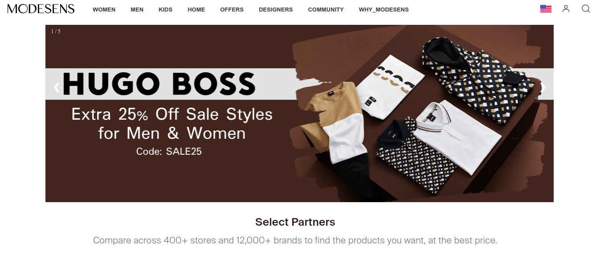

ModeSens clone>>
(https://modesens.com/)

<!-- Inspired by fashion and driven by technology -->

ModeSens is digital shopping assistant, a solution to the disconnected and crowded online shopping experience.

Web Refrences

- https://modesens.com/

- https://developer.mozilla.org/en-US/

- https://lms.masaischool.com/

Librairy Refrences

- Google Fonts - Font Awesome

Language and Tool Used

- HTML
- CSS
- JS
- VS Code
- Git

Screenshots

Description

I 've cloned this site ,got as an assignment during construct week curriculam of Masai School.I've used techiques like HTML,CSS & JS .

In this first Designed landing page then user 've to register then for that register & signin page then cart and after that payment page at last success page then cart will get empty & from there user can go to product page again
